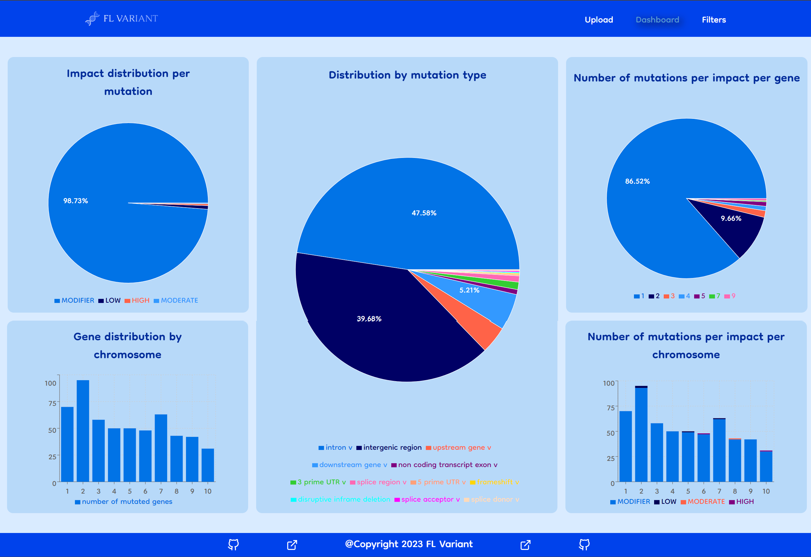
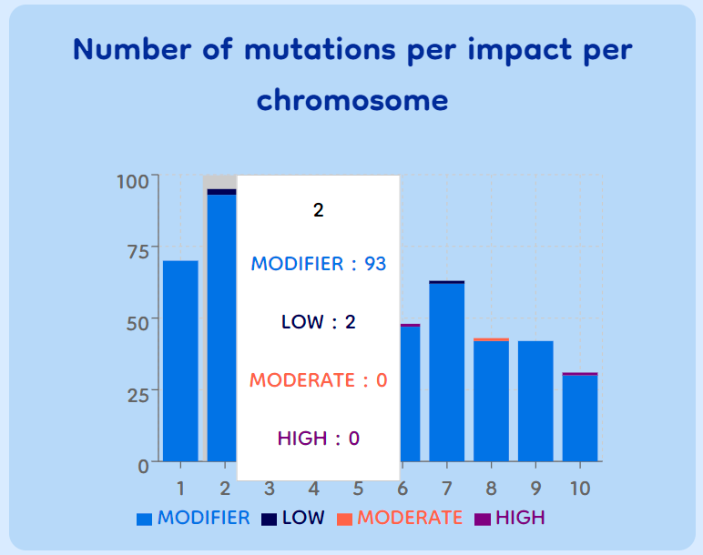
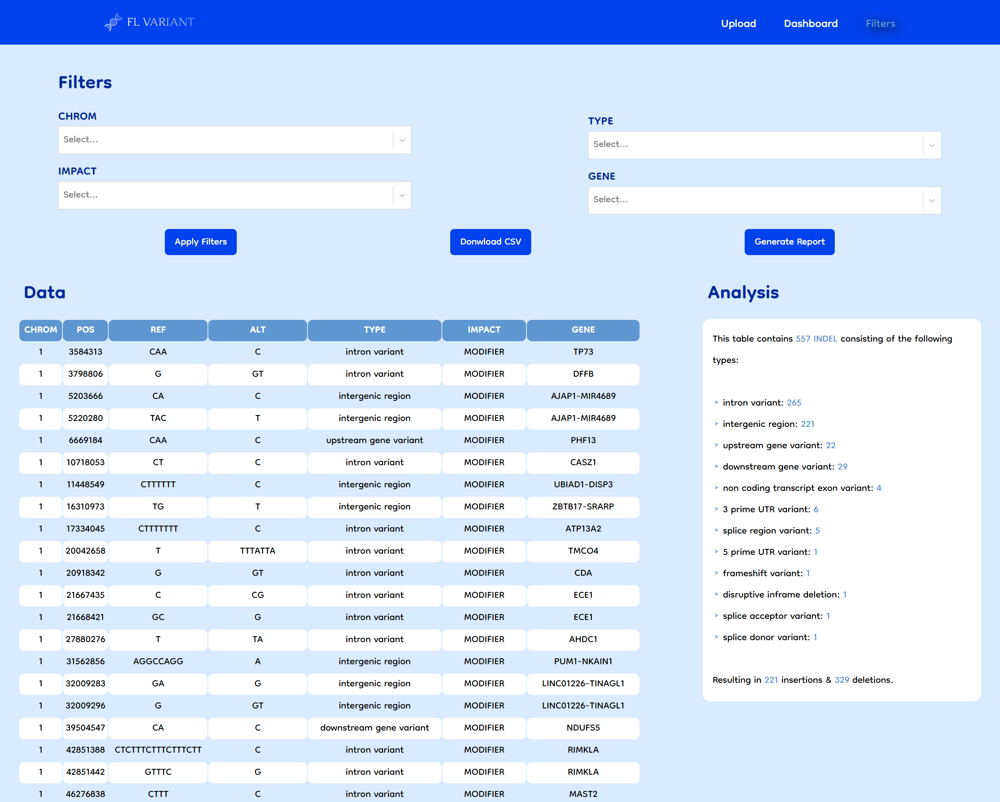
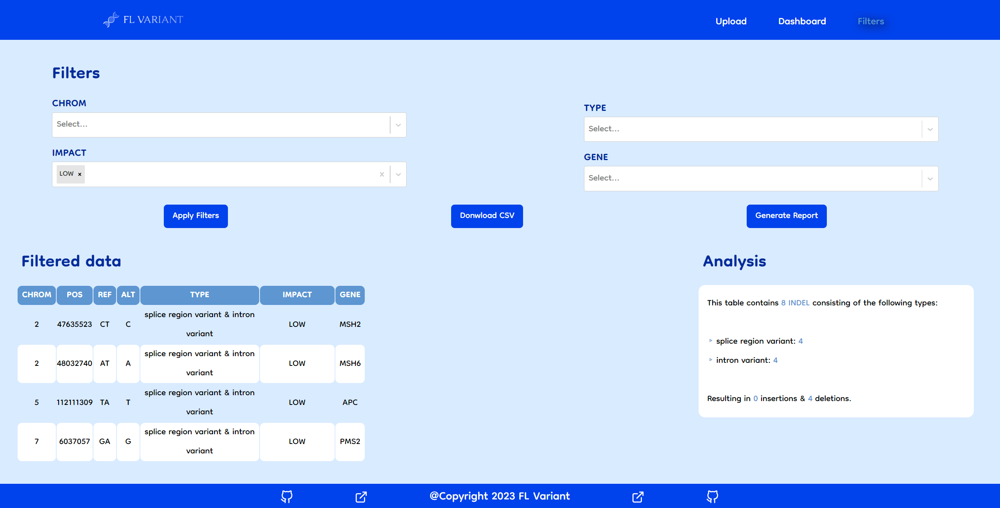

# FL Variant Web App

## General Introduction

This file is a synthesis of the work conducted during the project. It is organized into several sections to provide a comprehensive understanding of the different pillars, components, and implementation steps involved. To facilitate comprehension, it is preferable to have a basic understanding of bioinformatics. Bioinformatics is a discipline that combines biology and computer science to analyze and interpret large-scale biological data. In this project, bioinformatics plays a crucial role in processing VCF (Variant Call Format) files, annotating mutations, classifying variants, and visually representing the results. By combining computer science and biology skills, this project highlights the growing importance of bioinformatics in the fields of genomics and personalized medicine.

## Objectives

In the scope of this project, one of the main objectives is to allow users to upload and integrate genetic data into our dedicated platform for data visualization. This multiple import feature facilitates the exploration and simultaneous analysis of a diverse set of data from multiple VCF files.

To facilitate in-depth data exploration, we have implemented advanced filtering functionalities. Users can select and refine results based on specific criteria such as specific genes, chromosomes, types of mutations, or genomic impacts. This personalized filtering capability enables obtaining relevant and targeted results, emphasizing specific genetic characteristics of interest.

Once the data is filtered, our platform offers a rich and interactive visualization of the results. By utilizing dynamic graphs and diagrams, users can easily visualize the distribution of key information, including genes, mutations (SNP/indel), and chromosomes. This visual representation provides a clear and comprehensive understanding of the nature and distribution of observed genetic variations.

Finally, as a gesture of appreciation for the user's trust, our system automatically generates a personalized report containing the Dashboard and the filtered data that the user wanted to visualize.

## Features

- Upload multiple VCF files:

  - Allow users to upload data files in the appropriate format (e.g., VCF files).
  - Manage and securely store the data in an organized manner.

- Mutation type analysis:

  - Implement analysis algorithms to extract and classify mutation types from the provided data.

- Result filtering:

  - Set up filtering mechanisms to enable users to select genes, mutation types, genomic impacts, etc.
  - Apply the chosen filters to display the corresponding filtered results.

- Data visualization:

  - Utilize graphs and diagrams to represent the distribution of key information.
  - Create clear and interactive visualizations that facilitate easy understanding of the data.

- Report generation:
  - Automatically generate a report for each user, containing the analysis results and corresponding visualizations.
  - Ensure the report is well-structured, easy to read, and provides essential information concisely.

Please note that this is a high-level overview of the required features. Additional details and specifications may be needed during the development process.

## Results

Homepage:
As shown below, the homepage of our FL Variant website presents the site's features with a theme that aligns with the field of bioinformatics, including colors and a 3D animation of DNA. On the top navigation bar, you can find buttons to choose the specific functionality of the site you want to explore.


Dashboard:
The dashboard, depicted in the figure below, consists of a set of clear and concise data visualization charts. The charts are accompanied by titles and legends to enhance data understanding.



It's worth mentioning that when hovering over the bars in bar charts, a description appears, as shown in the figure below:



Filters:
First and foremost, please note that this section of FL Variant displays the CSV content in the form of a table for better reliability and transparency to the user. Above the table, there are dropdown menus to select the parameters for data filtering. Additionally, users can download the CSV file containing the extracted data from the VCF file. At the bottom right of this page, there is an analysis of the CSV types. After clicking the "Apply filters" button, the filtered table will be displayed. The FL Variant filter offers the flexibility for users to filter based on multiple parameter combinations, ensuring a comfortable and unrestricted user experience. It's important to mention that this page allows users to download the filtered version of the initial CSV and generate a report containing all the data visualized during their interaction with FL Variant.

Here's how the FILTERS section appears in our FL Variant:



Furthermore, the figure below showcases an example of filtering in FL Variant:



## Installation

This repository contains the Front End code for the FL Variant project. To get started, please follow these steps:

1. Visit [https://github.com/laze03/FL-Variant-Server](https://github.com/laze03/FL-Variant-Server) to download the server-side code for FL Variant.
2. Follow the instructions provided to set up and run the server.

### Downloading files

Once the server is running, follow these steps to run the Front End code:

1. Download or clone this repository.
2. Navigate to the main folder of the Front End code in your terminal.

### Installing Dependencies & running the Server

In the terminal, run the following commands:

```shell
npm install
npm run dev
```

Before you proceed, ensure that you have Node.js and npm installed in your working environment.

### Accessing the FL Variant Web App

Once the server is running and the dependencies are installed, you can access the FL Variant web app by following these steps:

1. Open your web browser.
2. Visit the following link: [http://localhost:3000/FL-Variant/](http://localhost:3000/FL-Variant/)

## Usage

1. Upload VCF files by clicking on the "Upload" button and selecting the desired files, a sample is provided when clicking on download sample.
2. Explore the mutation types analysis by navigating to the "Dashboard" section.
3. Use the advanced filtering options on the "Filters" page to refine your results based on specific criteria.
4. Visualize the data distribution using the interactive graphs and diagrams on the dashboard.
5. Generate a personalized report that includes the filtered data and the corresponding visualizations.
